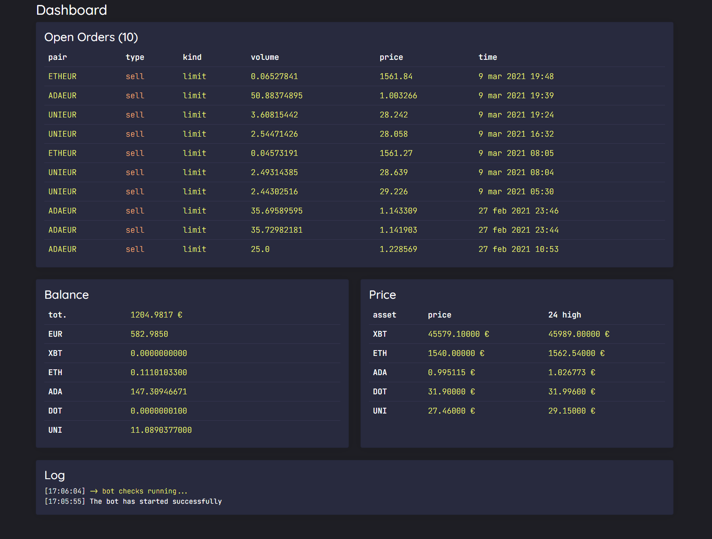
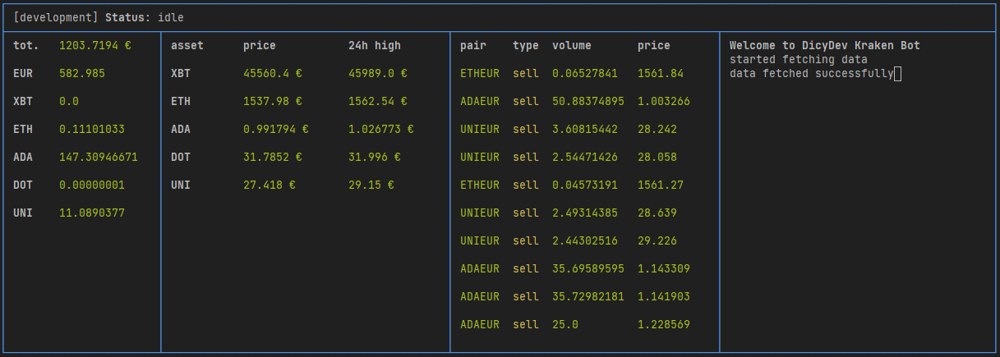

# Kraken Bot
A bot for Kraken that trades using the HODL strategy

Strategy:\
Check the 24h high for the asset:\
\> if (below 2% of 24 high and no recent order) or (below 2% of last buy order made within 24h and open orders < maxTrades):\
&nbsp;&nbsp;&nbsp;&nbsp;\> open buy order at market and open sell order at current price + 2%\
\> otherwise do nothing.

You should only trade on coins which you wish to HODL on, since it is part of the strategy.
### Comes with a minimal web dashboard

### Also comes with useful terminal dashboard



## Setup
1. edit and add your assets in assets.json
```json
[
  {
    "name": "XBT",
    "asset": "XXBT",
    "pair": "XXBTZEUR",
    "pairAlias": "XBTEUR",
    "maxDecimals": 1,
    "lotDecimals": 8,
    "tradeValue": 150,
    "maxTrades": 3
  },
  {
    "name": "ETH",
    "asset": "XETH",
    "pair": "XETHZEUR",
    "pairAlias": "ETHEUR",
    "maxDecimals": 2,
    "lotDecimals": 8,
    "tradeValue": 70,
    "maxTrades": 3
  },
  {
    "name": "ADA",
    "asset": "ADA",
    "pair": "ADAEUR",
    "pairAlias": "ADAEUR",
    "maxDecimals": 6,
    "lotDecimals": 8,
    "tradeValue": 40,
    "maxTrades": 1
  },
  {
    "name": "DOT",
    "asset": "DOT",
    "pair": "DOTEUR",
    "pairAlias": "DOTEUR",
    "maxDecimals": 4,
    "lotDecimals": 8,
    "tradeValue": 70,
    "maxTrades": 3
  },
  {
    "name": "UNI",
    "asset": "UNI",
    "pair": "UNIEUR",
    "pairAlias": "UNIEUR",
    "maxDecimals": 3,
    "lotDecimals": 8,
    "tradeValue": 70,
    "maxTrades": 3
  }
]
```
Parameters:\
`name` is your friendly name, make sure it is unique\
`asset`: this is the name of the assets in Kraken's API\
`pair`: this is the pair name used in Kraken's API\
`pairAlias`: friendly pair name, used in the dashboard\
`maxDecimals`: how many decimals we can use in order's price\
`lotDecimals`: how many decimals we can use in volume values\
`tradeValue`: the cost of each buy order\
`maxTrades`: the limit for how many orders we can have

2. test your basic settings in development mode (run `npm start`)

3. TODO
